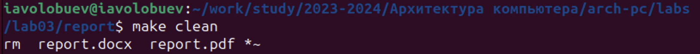

## Front matter
title: "Отчет по лабораторной работе №3"
subtitle: "Дисциплина: Архитектура компьютеров"
author: "Волобуев Иван Андреевич"

## Содержание
Цель работы	

Задание	

Теоретическое введение

Выполнение лабораторной работы

Выводы

Источники

## 1 Цель работы
Целью работы является освоение процедуры оформления отчетов с помощью легковесного языка разметки Markdown. 

## 2 Задание
1. Выполнение лабораторной работы
2. Выполнение заданий для самостоятельной работы

## 3 Теоретическое введение
Markdown - это легковесный язык разметки текста, который используется для форматирования документов, веб-страниц и других текстовых файлов. Он позволяет создавать структурированный текст с помощью простых символов и синтаксиса, который легко читать как обычный текст, и автоматически преобразовывать его в форматированный документ с использованием различных стилей, ссылок, заголовков и других элементов. Markdown широко применяется в блогах, вики-страницах, электронных письмах и других местах для удобного создания и форматирования текста.
## 4 Выполнение лабораторной работы
#1.Выполнение лабораторной работы
Открываю терминал(рис.1)

Рис. 1. Терминал

Перехожу в каталог курса сформированный при выполнении лабораторной работы №2 (рис. 2). 

Рис. 2. Перемещение между каталогами

Обновляю локальный репозиторий, скачав изменения из удалённого репозитория с помощью команды “git pull”(рис.3). 

Рис. 3. Обновление локального репозитория

Перехожу в каталог с шаблоном отчёта по лабораторной работе №3(рис. 4).

Рис. 4. Перемещение между каталогами

Провожу компиляцию шаблона с использованием Makefile с помощью команды “make” (рис. 5). 

Рис. 5. Компиляция шаблона

Удаляю полученные файлы с использованием Makefile с помощью команды “make clean" (рис. 6). 

Рис. 6. Удаление файлов

Открываю файл report.md с помощью текстового редактора gedit и внимательно изучаю содержимое(рис. 7). 

Рис. 7. Открытие файла

Заполняю отчёт (рис. 8). 

Рис. 8. Заполнение отчёта

Компилирую файл и загружаю отчёт на Github.

#2.Выполнение заданий для самостоятельной работы
Перехожу в каталог lab02/report , чтобы там заполнять отчёт по 2 лабораторной работе. Выполняю отчёт и проверяю корректность выполненного задания (рис.9).

Рис.9. Перемещение между каталогами

Добавляю файлы на Github с помощью командs ‘git add’.Сохраняю изменения с помощью команды ‘git commit’. Отправляю файлы на сервер с помощью команды ‘git push’  (рис.10,11,12). 

Рис. 10,11,12. Добавление , сохранение и отправление файлов на сервер 

## 5 Выводы
При выполнении лабораторной работы я освоил процедуры оформления отчётов с помощью легковесного языка разметки Markdown. 

## 6 Источники
1. [Архитектура ЭВМ (rudn.ru)](https://esystem.rudn.ru/pluginfile.php/1584618/mod_resource/content/1/%D0%9B%D0%B0%D0%B1%D0%BE%D1%80%D0%B0%D1%82%D0%BE%D1%80%D0%BD%D0%B0%D1%8F%20%D1%80%D0%B0%D0%B1%D0%BE%D1%82%D0%B0%20%E2%84%962.pdf)
10

